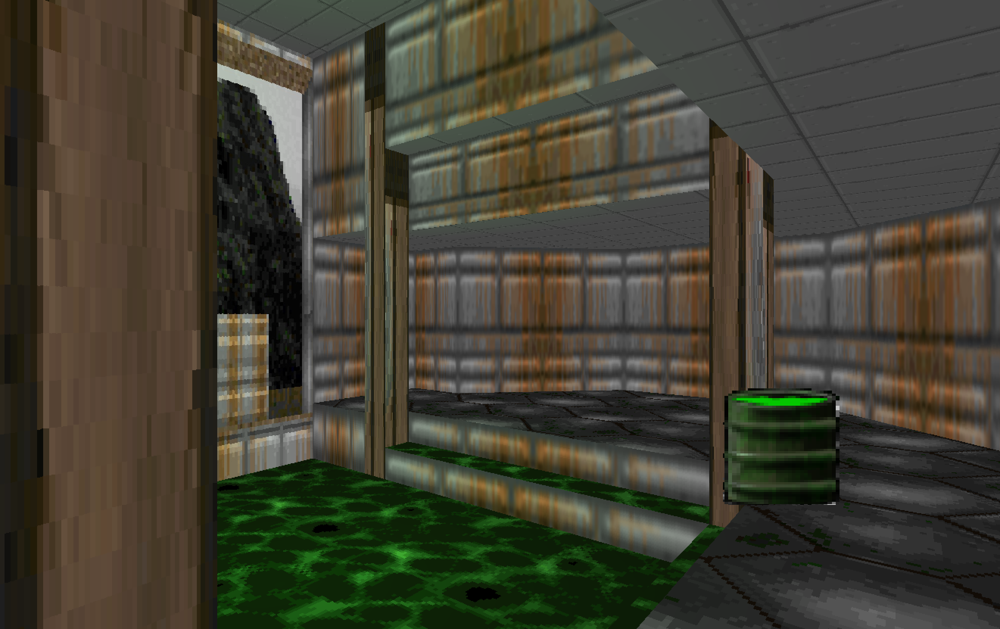
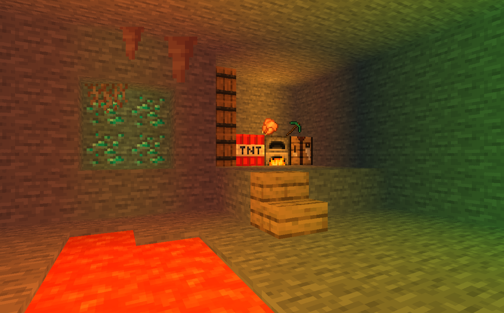
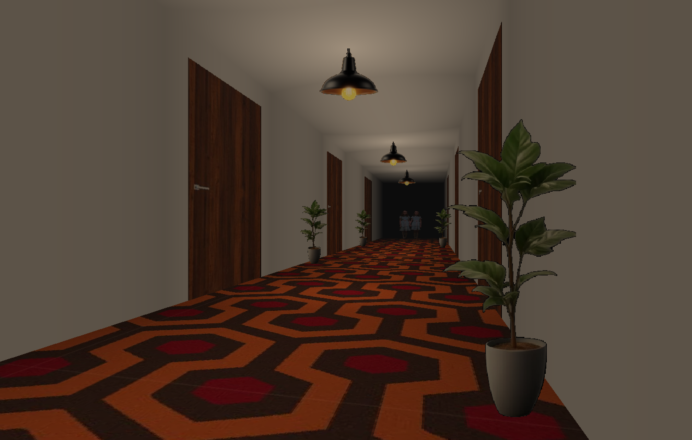
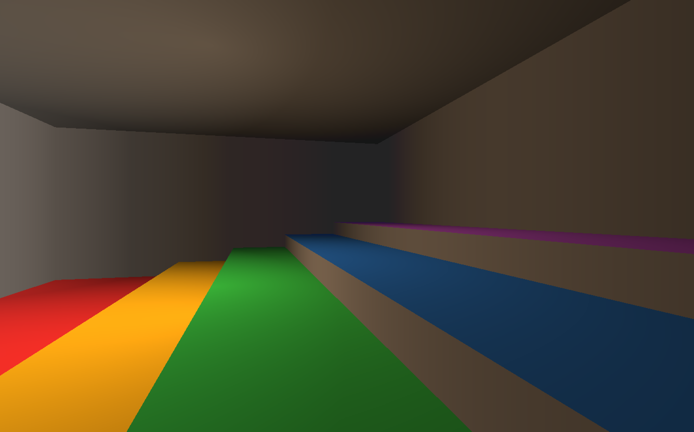

# DoomLike-Engine : Projet ISIM

Projet ISIM is a small 2.5D raycasting engine written in C++17. It renders sector-based maps
with textured walls, floors, ceilings, portals, sprites, lighting, and fog using SFML.

The project was created for the ISIM (*Introduction à la Synthèse d'Image*) course as part of
the IMAGE major at EPITA.

## Features

- Sector and portal-based level rendering
- Textured and animated materials
- Sprites, lighting, fog, collisions, and camera movement
- Several bundled maps inspired by different visual styles

## Screenshots

<table>
  <tr>
    <td align="center">
      <br>
      <sub>Doom-inspired map</sub>
    </td>
    <td align="center">
      <br>
      <sub>Minecraft-inspired map</sub>
    </td>
  </tr>
  <tr>
    <td align="center">
      <br>
      <sub>The Shining-inspired map</sub>
    </td>
    <td align="center">
      <br>
      <sub>Demo map</sub>
    </td>
  </tr>
</table>

## Requirements

- CMake 3.20 or later
- A C++17-compatible compiler
- OpenMP
- Git and an internet connection for the first configuration

SFML 3.0.2 and its dependencies are downloaded automatically by CMake.

### macOS

Install the Xcode Command Line Tools, CMake, and OpenMP:

```bash
xcode-select --install
brew install cmake libomp
```

On other platforms, install equivalent CMake, C++ compiler, and OpenMP packages with your
system package manager.

## Build

From the project root:

```bash
cmake -S . -B build -DCMAKE_BUILD_TYPE=Release
cmake --build build --config Release -j4
```

## Run

Launch one of the bundled maps with:

```bash
./scripts/launch.sh demo
```

Available maps are `demo`, `doom`, `mc`, `shining`, and `test`.

Lighting and fog can be disabled from the command line:

```bash
./scripts/launch.sh doom --no-lighting --no-fog
```

## Controls

| Key | Action |
| --- | --- |
| `W` / `A` / `S` / `D` | Move |
| Left / Right arrow | Rotate |
| Left Shift + Left / Right arrow | Rotate slowly |
| `Esc` | Quit |
